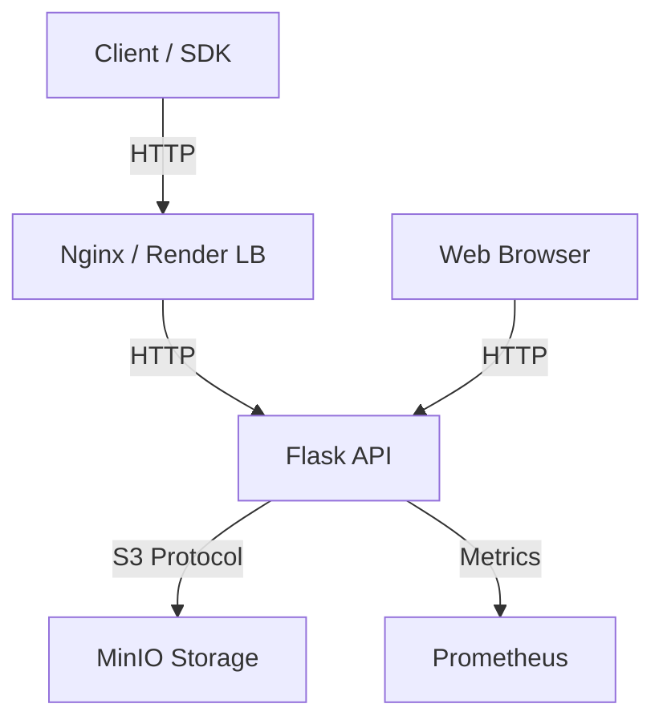

# AWS S3 Simulator ☁️


A production-ready, local AWS S3 Simulator built with Flask, MinIO, and Docker. Perfect for testing S3 integrations, learning DevOps practices, and portfolio demonstration.

## 🚀 Features

- **S3 Compatible API**: Built on top of MinIO, supporting standard S3 operations.
- **Web Interface**: Modern, responsive UI built with Tailwind CSS for managing buckets and objects.
- **DevOps Ready**: Dockerized with multi-stage builds, non-root user security, and Prometheus monitoring.
- **Client SDKs**: Ready-to-use Python and Node.js clients.
- **Robust Testing**: Comprehensive unit tests with >80% coverage.

## 🏗 Architecture



## 🛠 Quick Start

### Prerequisites
- Docker & Docker Compose

### Run Locally
1. **Clone the repository**
   ```bash
   git clone https://github.com/yourusername/aws-s3-simulator.git
   cd aws-s3-simulator
   ```

2. **Start the stack**
   ```bash
   docker-compose up --build
   ```

3. **Access the services**
   - **Web UI**: [http://localhost:5000](http://localhost:5000)
   - **API Docs**: [http://localhost:5000/api/v1](http://localhost:5000/api/v1)
   - **MinIO Console**: [http://localhost:9090](http://localhost:9090) (User: `admin`, Pass: `password123`)
   - **Prometheus**: [http://localhost:9090](http://localhost:9090)

## 📦 Client SDKs

### Python
```bash
pip install ./sdk/python
```
```python
from s3_simulator_client import S3SimulatorClient

client = S3SimulatorClient(base_url='http://localhost:5000/api/v1/s3')
client.create_bucket('my-bucket')
client.upload_file('my-bucket', 'data.txt')
```

### Node.js
```bash
cd sdk/node && npm install
```
```javascript
const S3SimulatorClient = require('./sdk/node');
const client = new S3SimulatorClient('http://localhost:5000/api/v1/s3');

await client.createBucket('my-bucket');
```

## 🚀 Deployment (Render)

This project is configured for auto-deployment on Render.

1. Fork this repo.
2. Create a new **Blueprint Instance** on Render.
3. Connect your repo.
4. Provide the `AWS_ENDPOINT_URL` (pointing to your MinIO/S3 instance).

## 🧪 Testing

Run the test suite with coverage:
```bash
pip install -r requirements.txt
python -m pytest --cov=api tests/
```

## 📝 License

MIT License. See [LICENSE](LICENSE) for details.
