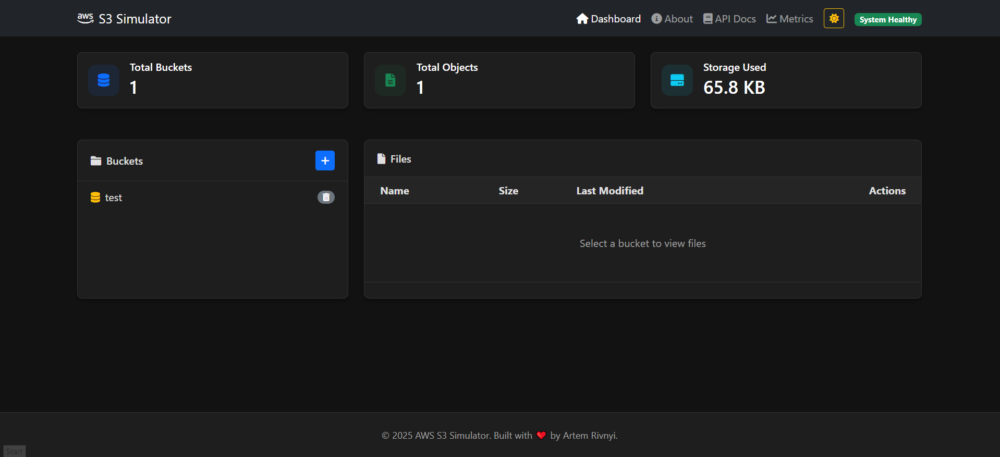
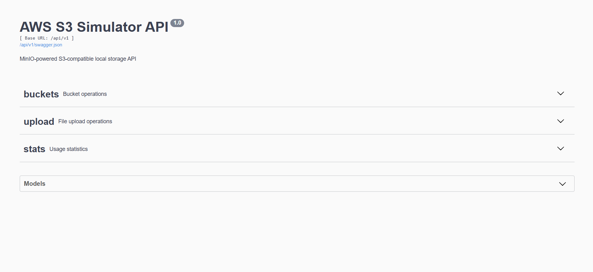
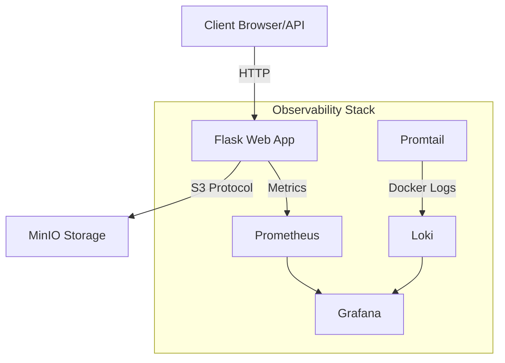

# AWS S3 Simulator (MinIO + Flask)

[](https://aws-s3-simulator.onrender.com/)
[](https://aws-s3-simulator.onrender.com/docs/)

<p align="left">
  
  
  
  
  
</p>

A lightweight, self-contained AWS S3 compatible object storage simulator built with MinIO and Flask. Designed for rapid prototyping, testing, and portfolio demonstration.

## 🌐 Live Demo
- **Application**: https://aws-s3-simulator.onrender.com/
- **API Docs**: https://aws-s3-simulator.onrender.com/docs/
- **Metrics**: https://aws-s3-simulator.onrender.com/metrics
- **Health Check**: https://aws-s3-simulator.onrender.com/health

### Try it out:
1. Open the dashboard
2. Create a new bucket
3. Upload files
4. Monitor real-time statistics

## ✨ Features
- **S3 Compatible API**: Powered by MinIO, fully compatible with AWS SDKs.
- **Web Dashboard**: Modern UI to manage buckets and files.
- **Single Container**: Runs both MinIO and API in one Docker container.
- **REST API**: Endpoints for stats, health checks, and management.
- **Prometheus Metrics**: Built-in metrics for monitoring.

## 🛠 Tech Stack
- **Backend**: Python 3.9, Flask, MinIO Python SDK
- **Storage Engine**: MinIO Server
- **Frontend**: Bootstrap 5, Vanilla JS
- **Deployment**: Docker, Render.com

## 📸 Screenshots

### Dashboard


### API Documentation


## 🚀 Quick Start

### Local Development (Docker)
```bash
# 1. Clone repository
git clone https://github.com/ArtemRivnyi/aws-s3-simulator.git
cd aws-s3-simulator

# 2. Build and Run
docker build -t aws-s3-sim .
docker run -p 5000:5000 -p 9000:9000 -p 9001:9001 aws-s3-sim
```
Access the dashboard at `http://localhost:5000`.

### Local Development (Manual)
```bash
# 1. Install dependencies
pip install -r requirements.txt

# 2. Start MinIO (requires MinIO binary)
minio server ./data --console-address ":9001" &

# 3. Start Flask App
python app.py
```

## 📊 Advanced Observability (Loki + Promtail + Grafana)
This project features a fully configured logging and metrics observability stack:

```bash
docker-compose up -d
```
- **Grafana Dashboard**: `http://localhost:3000` (User: `admin`, Pass: `admin`)
- **Prometheus**: `http://localhost:9091`
- **Loki**: `http://localhost:3100`

The system collects Flask HTTP Metrics (RPS, Latency) via Prometheus and Docker Container logs via Promtail, aggregating them into a unified **"AWS S3 Simulator Observability"** autoprovisioned dashboard.

## 📚 API Documentation
Swagger documentation is available at `/docs/`.

### Key Endpoints
- `GET /api/v1/buckets/` - List buckets
- `POST /api/v1/buckets/` - Create bucket
- `POST /api/v1/upload/` - Upload file
- `GET /api/v1/stats/` - Usage statistics
- `GET /health` - Health check

## 🏗 Architecture
The application runs as a single Docker container integrating storage, web services, and observability.


```mermaid
graph TD
    Client[Client Browser/API] -->|HTTP| Flask[Flask Web App]
    Flask -->|S3 Protocol| MinIO[MinIO Storage]
    
    subgraph "Observability Stack"
        Promtail[Promtail] -->|Docker Logs| Loki[Loki]
        Flask -->|Metrics| Prometheus[Prometheus]
        Prometheus --> Grafana[Grafana]
        Loki --> Grafana
    end
```

- **Entrypoint**: `scripts/start.sh` starts both processes.
- **MinIO**: Listens on 9000 (API) and 9001 (Console).
- **Flask**: Listens on 5000 (Web UI & API wrapper).

## 📝 License
This project is licensed under the MIT License - see the [LICENSE](LICENSE) file for details.

## 🧰 Maintainer
**Artem Rivnyi** — Junior Technical Support / DevOps Enthusiast

- 📧 [artemrivnyi@outlook.com](mailto:artemrivnyi@outlook.com)
- 🔗 [LinkedIn](https://www.linkedin.com/in/artem-rivnyi/)
- 🌐 [Personal Projects](https://github.com/ArtemRivnyi?tab=repositories)
- 💻 [GitHub](https://github.com/ArtemRivnyi)
